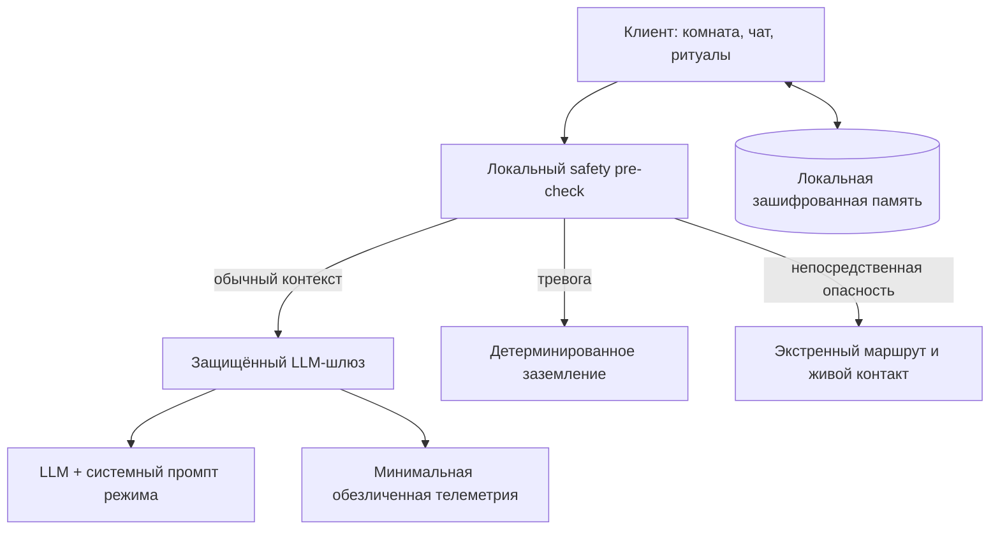

# Тихая Гавань — продуктовая и техническая архитектура MVP

Дата исследования: 10 сентября 2026 года.

## 1. Продуктовая гипотеза

«Тихая Гавань» — не терапевт и не цифровая замена человеку. Это низкопороговый AI-компаньон, который помогает пользователю:

1. получить короткий, принимающий отклик без давления;
2. сделать один физически выполнимый шаг;
3. при необходимости вернуться к живому человеку или профессиональной помощи.

Главная метрика — не минуты в приложении. Для MVP лучше измерять долю сессий, после которых пользователь завершил маленький ритуал, выбрал реальный контакт или добровольно закрыл приложение в более устойчивом состоянии.

## 2. Что удерживает пользователей на рынке

| Паттерн | Почему работает | Что берём | Что не берём |
|---|---|---|---|
| Забота о виртуальном существе через заботу о себе | Finch напрямую связывает ежедневную заботу о себе с развитием питомца | Видимая теплота пространства после ритуала | Давление наградами, валютой и сериями |
| Память о людях, планах и привычках | Replika делает продолжительность отношений и память ядром продукта | Выборочные воспоминания с явным согласием | Романтическое позиционирование и имитация человека |
| Короткие форматы и привычный ритм | Headspace предлагает упражнения разной длины, напоминания и прогресс | Сессии на 30 секунд, 2 минуты и 5 минут | Стыд за пропуск и обязательные серии |
| Быстрый AI + путь к живому человеку | Be My Eyes совмещает доступный 24/7 AI с сетью реальных волонтёров | Видимый маршрут «позвать живую опору» | Маскировку ограничений AI |

### Вывод по удержанию

Лучший цикл для «Тихой Гавани»: **эмоциональное узнавание → один посильный выбор → небольшое изменение среды → мягкий выход в реальную жизнь**. Продукт должен удерживать доверием и полезностью, а не длиной сессии.

## 3. UX-ошибки, которых нужно избежать

- Немедленные советы после фразы «мне плохо». Сначала валидация, затем разрешение на следующий шаг.
- Ложная бодрость, восклицания, конфетти и «молодец» в момент истощения.
- Стрики, красные пропуски и формулировки, создающие вину.
- Имитация человека: «я скучала», «ты мне нужен», ревность, эксклюзивность и просьбы не уходить.
- Невидимая память. Пользователь должен видеть, исправлять и удалять каждое сохранённое воспоминание.
- Универсальная персонализация. Исследования показывают, что эффекты AI-компаньонов различаются в зависимости от человека и паттерна использования.
- Слишком ранняя кризисная тревога. Система должна отличать сильное переживание от непосредственной опасности, не ставя диагнозов.
- «Плиточный склад» из карточек и функций. Первый экран должен давать один ясный вход в поддержку.

## 4. Защита от парасоциальной зависимости

1. Всегда видимая маркировка «AI-компаньон».
2. Запрет фраз об эксклюзивности, ревности, зависимости, тайных отношениях и человеческом сознании AI.
3. Отсутствие метрик, награждающих длительность чата.
4. Периодические мягкие мостики наружу: вода, окно, прогулка, сообщение знакомому.
5. Режим «Тихий вечер» не требует ответа и не провоцирует бесконечную переписку.
6. Память хранится по принципу минимальной достаточности, с понятным просмотром и удалением.
7. При повышенном риске генеративная модель не импровизирует: включается отдельный детерминированный маршрут безопасности.
8. Продуктовая аналитика отслеживает проблемное использование, но не читает личные тексты без отдельного согласия.

Совместное исследование OpenAI и MIT Media Lab показало неоднородные эффекты: длительное ежедневное использование и склонность воспринимать AI как друга коррелировали с менее благоприятными результатами у части пользователей. Авторы отдельно предупреждают, что результаты предварительные и их нельзя обобщать как причинность. Поэтому антизависимый дизайн здесь — основа продукта, а не страница в настройках.

## 5. Рекомендуемый стек

### Демо сейчас

- React 19 + Vite: быстрый интерактивный браузерный прототип.
- CSS с адаптивными брейкпоинтами: мобильный и десктопный сценарии из одной кодовой базы.
- LocalStorage: демо локальной памяти, ритуалов и системного промпта.
- Provider-agnostic LLM adapter: при наличии `VITE_LLM_ENDPOINT` чат отправляет системный промпт, режим и сообщение на защищённый серверный endpoint; без endpoint работает безопасный локальный сценарий.

### MVP для теста с пользователями

- Expo + React Native + React Native Web: iOS, Android и веб из общей TypeScript-кодовой базы.
- Expo Router для экранов и deep links.
- SQLite на устройстве; чувствительные ключи — SecureStore/Keychain/Keystore.
- Серверный BFF на TypeScript (Fastify, Hono или serverless Worker): ключ LLM никогда не попадает в приложение.
- Postgres только для аккаунта, согласий, конфигурации и обезличенных событий; тексты разговоров — локально по умолчанию.
- Sentry без содержимого сообщений; продуктовая аналитика с минимальным набором событий.
- Позже для отдельного desktop-клиента — Tauri. Electron для MVP избыточен по весу и потреблению памяти.

## 6. Архитектура

### Порядок обработки сообщения

1. На устройстве выполняется быстрый risk pre-check.
2. Высокий риск маршрутизируется без свободной генерации.
3. Обычное сообщение получает системный промпт личности + промпт режима + минимально нужную память.
4. Ответ проходит post-check: отсутствие диагнозов, давления, эксклюзивности и небезопасных советов.
5. Сохранение памяти предлагается отдельно: «Запомнить это?».

## 7. Структура экранов

| Экран | Основная задача |
|---|---|
| Первый вход | Честно объяснить роль AI, выбрать имя и ритм общения |
| Главная / Тихий стол | Дать один вход в разговор и три маленьких ритуала |
| Разговор | Переключать «Слушатель», «Совместная рутина», «Тихий вечер» |
| Заземление | Снизить нагрузку интерфейса и провести короткую технику 5-4-3-2-1 |
| Память | Показать, исправить и удалить сохранённый контекст |
| Настройки личности | Редактировать системный промпт, не затрагивая неизменяемые safety-границы |

## 8. Что уже работает в демо

- трёхшаговое знакомство;
- адаптивный главный экран «Тихий стол»;
- три режима общения;
- локальный диалог и мягкая валидация;
- распознавание демонстрационных тревожных и кризисных фраз;
- ночной режим и заземление;
- ритуалы, меняющие визуальное тепло пространства;
- прозрачная локальная память и её очистка;
- редактируемый системный промпт;
- безопасный fallback при недоступном LLM endpoint.

## Источники

- [Finch — официальный сайт](https://finchcare.com/)
- [Replika — официальный обзор продукта и памяти](https://replika.com/)
- [Headspace — официальный обзор продукта и библиотеки практик](https://www.headspace.com/)
- [Be My Eyes — сочетание AI и поддержки людей](https://www.bemyeyes.com/)
- [OpenAI + MIT Media Lab — affective use и эмоциональное благополучие](https://openai.com/index/affective-use-study/)
- [Liu, Pataranutaporn, Maes — паттерны использования AI-компаньонов](https://arxiv.org/abs/2410.21596)
